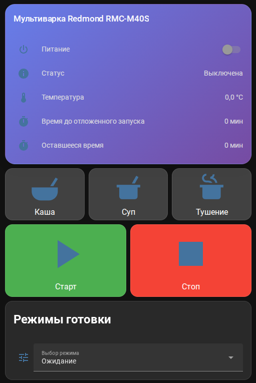
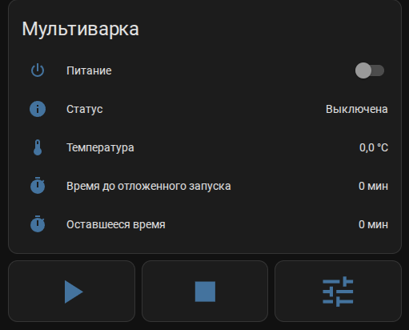
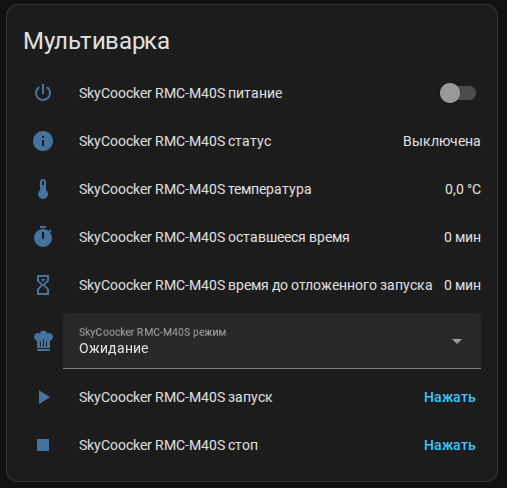

# 🎨 Пример карточки для Lovelace

Для удобного управления мультиваркой через интерфейс Home Assistant мной была разработана специальная карточка [skycooker-ha-card](https://github.com/kai-zer-ru/skycooker-ha-card). Эта карточка предоставляет расширенные возможности для управления и мониторинга мультиварки.

## 🔗 Содержание

- [Полноценный пример с card-mod (полный view)](#полноценный-пример-с-card-mod-полный-view)
- [Простая карточка для вставки в существующий view](#простая-карточка-для-вставки-в-существующий-view)
- [Карточка с custom:button-card](#карточка-с-custombutton-card)
- [Минимальная карточка (без card-mod)](#минимальная-карточка-без-card-mod)
- [Советы по настройке](#советы-по-настройке)

## Полноценный пример с card-mod (полный view)



```yaml
views:
  - title: Кухня
    cards:
      - type: vertical-stack
        cards:
          # Основная карточка с информацией
          - type: entities
            title: Мультиварка Redmond RMC-M40S
            show_header_toggle: false
            entities:
              - entity: switch.skycooker_auto_warm
                name: Автоподогрев
                icon: mdi:heat-wave
              - entity: sensor.skycooker_status
                name: Статус
                icon: mdi:information
              - entity: sensor.skycooker_temperature
                name: Температура
                icon: mdi:thermometer
              - entity: sensor.skycooker_remaining_time
                name: Оставшееся время
                icon: mdi:timer
            card_mod:
              style: |
                ha-card {
                  background: linear-gradient(135deg, #667eea 0%, #764ba2 100%);
                  border-radius: 20px;
                  box-shadow: 0 10px 30px rgba(0,0,0,0.2);
                }
                .card-header {
                  color: white;
                  font-weight: bold;
                  font-size: 1.2em;
                }
                .card-content {
                  padding: 16px;
                }
                .entity {
                  color: white;
                  margin: 8px 0;
                }
                .name {
                  font-weight: 500;
                }
                .state {
                  font-weight: 300;
                }

          # Карточка управления
          - type: horizontal-stack
            cards:
              - type: button
                tap_action:
                  action: call-service
                  service: select.select_option
                  target:
                    entity_id: select.skycooker_mode
                  data:
                    option: "Молочная каша"
                name: Каша
                icon: mdi:bowl-mix
                card_mod:
                  style: |
                    ha-card {
                      background: rgba(255,255,255,0.2);
                      color: white;
                      border-radius: 15px;
                      padding: 12px;
                      transition: all 0.3s;
                    }
                    ha-card:hover {
                      background: rgba(255,255,255,0.3);
                      transform: scale(1.05);
                    }

              - type: button
                tap_action:
                  action: call-service
                  service: select.select_option
                  target:
                    entity_id: select.skycooker_mode
                  data:
                    option: "Суп"
                name: Суп
                icon: mdi:pot-mix
                card_mod:
                  style: |
                    ha-card {
                      background: rgba(255,255,255,0.2);
                      color: white;
                      border-radius: 15px;
                      padding: 12px;
                      transition: all 0.3s;
                    }
                    ha-card:hover {
                      background: rgba(255,255,255,0.3);
                      transform: scale(1.05);
                    }

              - type: button
                tap_action:
                  action: call-service
                  service: select.select_option
                  target:
                    entity_id: select.skycooker_mode
                  data:
                    option: "Тушение"
                name: Тушение
                icon: mdi:pot-steam
                card_mod:
                  style: |
                    ha-card {
                      background: rgba(255,255,255,0.2);
                      color: white;
                      border-radius: 15px;
                      padding: 12px;
                      transition: all 0.3s;
                    }
                    ha-card:hover {
                      background: rgba(255,255,255,0.3);
                      transform: scale(1.05);
                    }

          # Карточка управления
          - type: horizontal-stack
            cards:
              - type: button
                tap_action:
                  action: call-service
                  service: button.press
                  target:
                    entity_id: button.skycooker_start
                name: Старт
                icon: mdi:play
                card_mod:
                  style: |
                    ha-card {
                      background: #4CAF50;
                      color: white;
                      border-radius: 15px;
                      padding: 12px;
                      transition: all 0.3s;
                    }
                    ha-card:hover {
                      background: #45a049;
                      transform: scale(1.05);
                    }

              - type: button
                tap_action:
                  action: call-service
                  service: button.press
                  target:
                    entity_id: button.skycooker_stop
                name: Стоп
                icon: mdi:stop
                card_mod:
                  style: |
                    ha-card {
                      background: #f44336;
                      color: white;
                      border-radius: 15px;
                      padding: 12px;
                      transition: all 0.3s;
                    }
                    ha-card:hover {
                      background: #d32f2f;
                      transform: scale(1.05);
                    }

          # Карточка с выбором программы
          - type: entities
            title: Программы приготовления
            show_header_toggle: false
            entities:
              - entity: select.skycooker_mode
                name: Выбор программы
                icon: mdi:tune
            card_mod:
              style: |
                ha-card {
                  background: rgba(255,255,255,0.1);
                  border-radius: 15px;
                  backdrop-filter: blur(10px);
                }
                .card-header {
                  color: white;
                  font-weight: bold;
                }
                .card-content {
                  padding: 16px;
                }
                .entity {
                  color: white;
                }
```

## Простая карточка для вставки в существующий view



```yaml
- type: vertical-stack
  cards:
    # Основная информация
    - type: entities
      title: Мультиварка
      show_header_toggle: false
      entities:
        - entity: switch.skycooker_auto_warm
          name: Автоподогрев
          icon: mdi:heat-wave
        - entity: sensor.skycooker_status
          name: Статус
          icon: mdi:information
        - entity: sensor.skycooker_temperature
          name: Температура
          icon: mdi:thermometer
        - entity: sensor.skycooker_remaining_time
          name: Оставшееся время
          icon: mdi:timer

    # Быстрые кнопки управления
    - type: horizontal-stack
      cards:
        - type: button
          tap_action:
            action: call-service
            service: button.press
            target:
              entity_id: button.skycooker_start
          name: Старт
          icon: mdi:play
          show_name: false
          show_icon: true

        - type: button
          tap_action:
            action: call-service
            service: button.press
            target:
              entity_id: button.skycooker_stop
          name: Стоп
          icon: mdi:stop
          show_name: false
          show_icon: true

        - type: button
          tap_action:
            action: more-info
            target: {}
          entity: select.skycooker_mode
          name: Программа
          icon: mdi:tune
          show_name: false
          show_icon: true
```

## Карточка с custom:button-card



```yaml
- type: custom:button-card
  entity: select.skycooker_mode
  name: Мультиварка
  icon: mdi:pot-mix
  styles:
    card:
      - width: 300px
      - height: 200px
    grid:
      - grid-template-areas: '"i n" "i s"'
      - grid-template-columns: 1fr 1fr
  custom_fields:
    buttons:
      card:
        type: custom:button-card
        entity: script.start_multicooker_milk_porridge
        name: Молочная каша
        icon: mdi:bowl-mix
        styles:
          card:
            - width: 100px
            - height: 100px
```

## Минимальная карточка (без card-mod)

```yaml
- type: entities
  title: Мультиварка
  entities:
    - switch.skycooker_auto_warm
    - sensor.skycooker_status
    - sensor.skycooker_temperature
    - sensor.skycooker_remaining_time
    - select.skycooker_mode
    - button.skycooker_start
    - button.skycooker_stop
```

## Советы по настройке

1. **Установите card-mod**:
   ```bash
   hacs install card-mod
   ```

2. **Добавьте ресурс**:
   ```yaml
   resources:
     - url: /hacsfiles/lovelace-card-mod/card-mod.js
       type: module
   ```

3. **Настройте тему**: Для лучшего отображения используйте темную тему или настройте цвета под ваш интерьер.